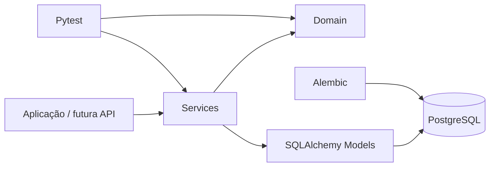

# Bella Napoli

Backend de um sistema de pedidos para uma pizzaria, desenvolvido em Python com PostgreSQL e SQLAlchemy, com foco em regras de negócio, persistência de dados, checkout, pagamentos e testes automatizados.

> **Status:** Em desenvolvimento — o núcleo de domínio e serviços do backend está implementado e validado. A camada de API HTTP será construída na próxima etapa.

## Overview

O Bella Napoli está sendo desenvolvido como um sistema de pedidos capaz de representar o fluxo de uma compra desde a configuração dos produtos até a finalização do pedido e o processamento do pagamento.

O backend atualmente contempla catálogo, variantes de produtos, clientes, endereços, pedidos, personalização de pizzas, entrega, horários de funcionamento, precificação, histórico de status e pagamentos.

A aplicação utiliza PostgreSQL para persistência, SQLAlchemy para mapeamento objeto-relacional e Alembic para versionamento do schema do banco de dados.

## Principais recursos

* Catálogo com categorias, produtos e variantes.
* Configuração de pizzas inteiras e meio a meio.
* Seleção de sabores e bordas com regras de preço.
* Cadastro de clientes e endereços.
* Pedidos com itens e dados registrados no momento da compra.
* Cálculo de subtotal, taxa de entrega e total.
* Validação de zonas de entrega atendidas.
* Controle de horários de funcionamento.
* Histórico das mudanças de status dos pedidos.
* Checkout com retirada ou entrega.
* Pagamentos em dinheiro, cartão e PIX demonstrativo.
* Controle de tentativas e estados de pagamento.
* Confirmação idempotente de pagamentos PIX.
* Expiração de pagamentos PIX.
* Migrations de banco de dados com Alembic.
* Scripts para carga inicial de catálogo, bordas, zonas de entrega e horários.
* Suíte automatizada de testes para regras de domínio e serviços.

## Arquitetura

O backend separa as responsabilidades entre regras de negócio, serviços de aplicação e persistência.



### Organização das camadas

| Diretório       | Responsabilidade                                                   |
| --------------- | ------------------------------------------------------------------ |
| `app/domain/`   | Regras de negócio, validações, precificação e transições de estado |
| `app/services/` | Fluxos de pedidos, checkout e pagamentos                           |
| `app/models/`   | Modelos SQLAlchemy persistidos no banco                            |
| `app/db/`       | Configuração da integração com o banco                             |
| `app/core/`     | Configurações centrais da aplicação                                |
| `alembic/`      | Migrations e evolução do schema                                    |
| `scripts/`      | Scripts de carga inicial e utilitários                             |
| `tests/`        | Testes automatizados                                               |

## Tech Stack

### Backend

* Python
* SQLAlchemy
* PostgreSQL
* Alembic

### Testing

* Pytest

## Estrutura do projeto

```text
bella-napoli/
├── backend/
│   ├── alembic/
│   │   └── versions/
│   ├── app/
│   │   ├── core/
│   │   ├── db/
│   │   ├── domain/
│   │   ├── models/
│   │   └── services/
│   ├── scripts/
│   ├── tests/
│   ├── .env.example
│   ├── alembic.ini
│   └── requirements.txt
├── docs/
├── frontend/
└── README.md
```

## Banco de dados

O projeto utiliza PostgreSQL como banco de dados principal.

A evolução do schema é controlada por migrations do Alembic, atualmente cobrindo entidades relacionadas a:

* categorias e produtos;
* variantes de produtos;
* cl
